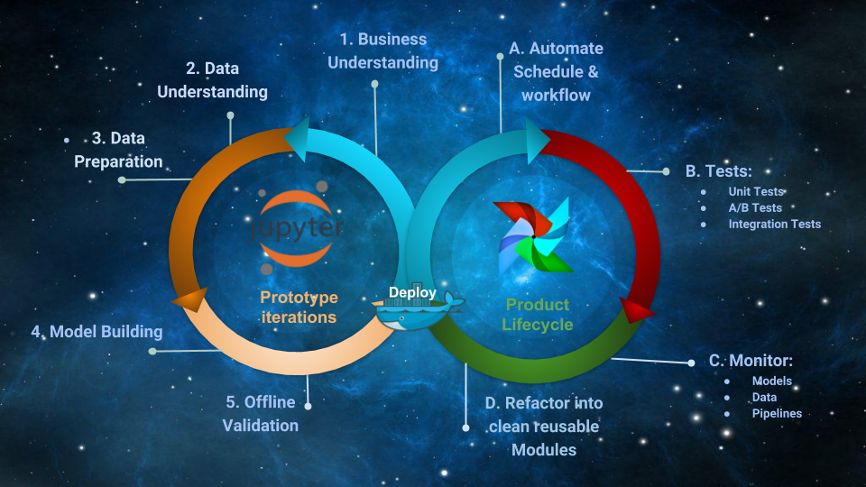

==========
AIscalator
==========

.. image:: https://img.shields.io/pypi/v/aiscalator.svg
        :target: https://pypi.python.org/pypi/aiscalator

.. image:: https://img.shields.io/travis/Aiscalate/aiscalator.svg
        :target: https://travis-ci.org/Aiscalate/aiscalator

.. image:: https://readthedocs.org/projects/aiscalator/badge/?version=latest
        :target: https://aiscalator.readthedocs.io/en/latest/?badge=latest
        :alt: Documentation Status

.. image:: https://requires.io/github/Aiscalate/aiscalator/requirements.svg?branch=master
        :target: https://requires.io/github/Aiscalate/aiscalator/requirements/?branch=master
        :alt: Requirements Status

.. image:: https://api.codacy.com/project/badge/Grade/16c9117a680041f382ba48bd5cf73ca2
        :target: https://www.codacy.com/app/ChristopheDuong/aiscalator

* Free software: Apache Software License 2.0
* Website: http://www.aiscalate.com
* Documentation: https://aiscalator.readthedocs.io.
* Bugs: https://github.com/aiscalate/aiscalator/issues

Key Features
------------

Aiscalator is a toolbox to enable your team streamlining
processes from innovation to productization with:

* Jupyter workbench
    * Explore Data, Prototype Solutions
* Docker wrapper tools
    * Share Code, Deploy Reproducible Environments
* Airflow machinery
    * Schedule Tasks, Refine Products
* Data Science and Data Engineering best practices

===========
Quick Start
===========

Installation
------------

Test if prerequisite softwares are installed:

.. code-block:: shell

    docker --version
    docker-compose --version
    pip --version

Install AIscalator tool::

    git clone https://github.com/Aiscalate/aiscalator.git
    cd aiscalator/
    pip install -r requirements_dev.txt
    make install

Great, we are now ready to use the AIscalator!

The following setup commands are completely optional because they are dealing with
prebuilding Docker images. If you choose not to do it at this point, they
will get built later on whenever they are required.

However, since producing a Docker image requires a certain amount of time
to download, install packages, and sometimes even compiling them, these
installation steps can be initiated right away all at once. Thus, you
should be free to go enjoy a nice coffee break!

You might want to customize your environment with the AIscalator, this
will ask you few questions::

    aiscalator setup

Build docker images to run Jupyter environments::

    aiscalator jupyter setup

Build docker image to run Airflow::

    aiscalator airflow setup

Start working
-------------

AIscalator commands dealing with jupyter are defining tasks in Airflow jargon;
In our case, they are all wrapped inside a Docker container. We also refer to
them as Steps.

Whereas AIscalator commands about airflow are made to author, schedule and monitor
DAGs (Directed Acyclic Graphs). They define how a workflow is composed of multiple
steps, their dependencies and execution times or triggers.

Jupyter
-------

Create a new Jupyter notebook to work on, define corresponding AIscalator step::

    aiscalator jupyter new <path-to-store-new-files>
    # For example,
    aiscalator jupyter new src

Or you can edit an existing AIscalator step::

    aiscalator jupyter edit <aiscalator step>
    # For example, if you cloned the git repository:
    aiscalator jupyter edit resources/example/example.json

Run the step without GUI::

    aiscalator jupyter run <aiscalator task>
    # For example, if you cloned the git repository:
    aiscalator jupyter run resources/example/example.json

Airflow
-------

Start Airflow services::

    aiscalator airflow start

Create a new AIscalator DAG, define the airflow job::

    aiscalator airflow new

Or you can edit an existing AIscalator DAG::

    aiscalator airflow edit <aiscalator DAG>

Schedule AIscalator DAG into local airflow dags folder::

    aiscalator airflow push <aiscalator DAG>

